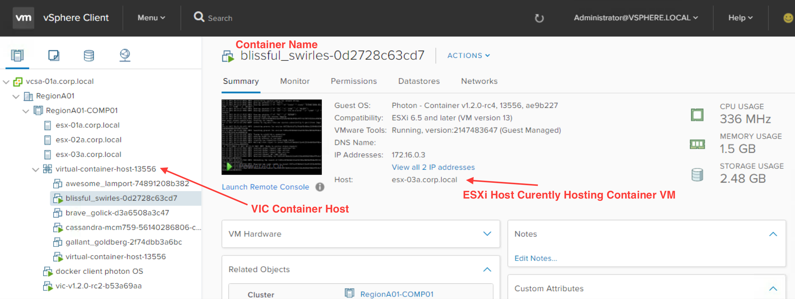
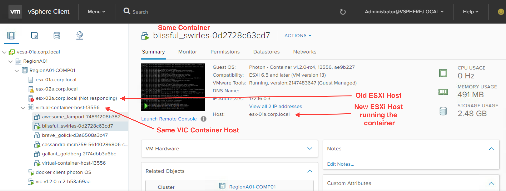

Copyright © 2017 VMware, Inc. All Rights Reserved.

# Persistent Storage for vSphere Integrated Containers

Docker has been great for stateless workloads.  While stateful workloads can run in containers, a limiting factor has been that most methods of providing storage for the state has been limited to the host serving the container.  That storage becomes inaccessible if the host fails.  vSphere Integrated Containers (VIC) allows a transparent loss of the host.

[vSphere Integrated Containers](https://www.vmware.com/products/vsphere/integrated-containers.html) is a container solution integrated in vSphere and that leverages the strengths of vSphere to run container images in production.  While stand-alone docker hosts are great during development, production use calls for a robust infrastructure for managing container workloads.

Let's dive into some of the the storage concerns with docker containers and see how they are addressed in VIC.

## Docker Image Layers

Container images are different from running containers.  The images are static artifacts that are built and stored in docker registries for use when running a new container.  Images are just a set of files that make up the filesystem available to a running container.

Running containers are composed of layers of images applied in a stack  The underlying layers remain unaltered.  While running, any changes to the filesystem will be persisted to an extra layer called the container layer.  The container layer is removed when the container is removed.

Here is an example to illustrate what's going on in image layers. This docker file builds on top of the alpine-3.6 image layer.

```
FROM alpine:3.6

RUN echo -e "#!/bin/sh\ndate\nsleep 2d\ndate" >/bin/our-application
RUN chmod 755 /bin/our-application
CMD ["/bin/our-application"]
```

Building an image using this docker file results in an image with several layers that can be seen using `docker history`.

```
$ docker build -f Dockerfile.example-1 -t demo:0.1 .
Sending build context to Docker daemon  7.168kB
Step 1/4 : FROM alpine:3.6
 ---> 76da55c8019d
Step 2/4 : RUN echo -e "#!/bin/sh\ndate\nsleep 2d\ndate" >/bin/our-application
 ---> Running in dfce6e80a2fb
 ---> 9295df9995e6
Removing intermediate container dfce6e80a2fb
Step 3/4 : RUN chmod 755 /bin/our-application
 ---> Running in cdc0e6d7ba27
 ---> 1d5559a943d4
Removing intermediate container cdc0e6d7ba27
Step 4/4 : CMD /bin/our-application
 ---> Running in d44e2734bef0
 ---> 31af83e49686
Removing intermediate container d44e2734bef0
Successfully built 31af83e49686
Successfully tagged demo:0.1

$ docker history demo:0.1
IMAGE               CREATED             CREATED BY                                      SIZE                COMMENT
31af83e49686        2 minutes ago       /bin/sh -c #(nop)  CMD ["/bin/our-applicat...   0B
1d5559a943d4        2 minutes ago       /bin/sh -c chmod 755 /bin/our-application       29B
9295df9995e6        2 minutes ago       /bin/sh -c echo -e "#!/bin/sh\ndate\nsleep...   29B
76da55c8019d        4 weeks ago         /bin/sh -c #(nop)  CMD ["/bin/sh"]              0B
<missing>           4 weeks ago         /bin/sh -c #(nop) ADD file:4583e12bf5caec4...   3.97MB
```

The alpine layer is there at the bottom, and our additional commands have generated a few more layers that get stacked on top to be the image we want.  The final image that has all of the files we need is referenced by the ID 31af83e49686 or by the tag demo:0.1.  Each of those layers should be stored in a registry, and can be re-used by future images.

When we run the container, an additional container layer is created that allows modification of the filesystem by the running system.  If no changes are made to the filesystem, this layer remains empty.  Let's run the image as a container, and modify it's filesystem:

```
$ docker run -d --name demo --rm  demo:0.1
$ docker exec -it demo sh
/ # ls /
bin    dev    etc    home   lib    media  mnt    proc   root   run    sbin   srv    sys    tmp    usr    var
/ # date > /demo-state
/ # ls /
bin         dev         home        media       proc        run         srv         tmp         var
demo-state  etc         lib         mnt         root        sbin        sys         usr
```
As long as the container runs, the file `demo-state` will exist and have the same contents.  Stopping and starting the container has no effect on the container layer, so `demo-state` will still exist.

If we stop and remove the container, the container layer will be removed, and our hold on the `demo-state` file.  Running a new instance of the container will have a new empty container layer.

For more details on the structure of images see https://docs.docker.com/engine/userguide/storagedriver/imagesandcontainers/

I want to call out a distinction here that the container layer is ephemeral storage.  It's around while the container is, and lost when the container goes away.  This is in contrast to what we need for data that needs to remain after the container is removed.  I'll talk about persistent storage coming up.


## Why aren't containers persistent?

The lack of persistence in the image layers is by design.  By choosing to only allow ephemeral storage, we can ensure the application we put into a container image is always the application being run.  Images are versioned so that we can be sure that two systems are running exactly the same code.  Re-running the same image will always produce the same running conditions.

The immutability of the images results in better ability to debug, smoother deployments, and the ability to quickly replace running applications that appear to be in a bad state.

Let's flip it around; If container images were able to change, how could I be sure running a specific image today and running it tomorrow would have the same results?  How could I debug an image on my laptop, and be sure I am seeing the same code that is having a problem in QA?  If an application has persisted state in its local image, how do other instances of the application container get access to that data?

## Ok, lack of persistence is good for the container... how do I save data?

At some point, most of our applications need to leverage some data.
How do we keep state between runs of an image?  There are a at least a few patterns:

1. replication
2. recreate data or replay transactions
3. filesystem persistance

### Replication

If you can design your application to replicate data to other containers, and ensure at least one copy is always running then you're using this pattern.

An example of this patterns is running a Cassandra database cluster, where replication enables the dynamic addition or removal of nodes.  If running Cassandra in containers, and being good about bootstrapping, and removing nodes, then you could run a stable database cluster with normal basic `docker run`.  The persistence is handled by storing data in the container layer.  As long as enough containers are up, persistence is maintained.

There should be a blog entry about this specific use case in the near future.

### Re-create or replay data on loss

If you can design your application to be able to re-create any needed data, you're using this pattern.

An example of this might be a prime number finder tasked with finding a set of prime numbers in a range of numbers by counting up from the low end of the range and testing each number for primality.
If the primes are stored for future use, but the data is lost for any reason, a new instance of the process
can scan the same range and would find the same numbers that the original process found.
In this case, the data is inherent to the requirements of the process, so the data can be
recreated.

A more efficent varient of this process would store each found prime and the last number tested in apache Kafka.
Given a consistent initial range and the transaction log,
we can quickly get back to a known state without re-testing each number for primality, and continue processing from there.

### Persistent Filesystem

We can leverage an existing persistent filesystem that lives on the docker host inside the container.  This is a pattern most of us are familiar with, as it has been *the* way to handle data persistence since tape drives were invented.

Docker has two ways of handing a persistent filesystem in containers **bind mounts** and **volumes**.  Both of these expose a filesystem into the container from the running host.  They are very similar, but the bind mount is a bit more limited than using volumes.

#### bind mount

This is simply mounting a host filesystem file or directory into the container. This is not very different from mounting a CDROM onto a VM.  The host path may look like `/srv/dir-to-mount`, and inside the container, you may be able to access the directory at `/mnt/dir-to-mount`.

Bind mounting is used all the time in development, but should never be used in production.  It ties the container to the specific host at runtime, and if the host is lost, so is the data. Volumes are the answer for production requirements.

#### volumes

Volumes are the preferred way to use persistent storage in docker.

This is slightly different from a simple bind mount.  Here, docker creates a directory that is the volume, and mounts it just as in a bind mount. In contrast to bind mounts, docker manages the lifecycle of this volume, and by doing so allows the ability to use storage drivers that enable the backing storage to exist outside of the host running the container.

VIC leverages this to use vSphere storage types like vSAN, iSCSI, and NFS to back the volume.  Doing this means we can get handle failures of any host running the container, and ensure access to the data in the volume to resume running on a different host.

Another example of leveraging the storage drivers of docker volumes is shown in [vSphere Docker Volume Service](https://blogs.vmware.com/virtualblocks/2016/06/20/vsphere-docker-volume-driver-brings-benefits-of-vsphere-storage-to-containers/).  This driver enables using vSphere backed storage when using native docker hosts, and not VIC.

For deeper coverage on volumes, see [Docker's volume document](https://docs.docker.com/engine/admin/volumes/volumes/).

Lets take a closer look at using volumes to persist data in VIC.

## VIC Volumes

Command line use of volumes in VIC is exactly the same as standard docker, with the benefit of the storage being backed by vSphere Storage.

In VIC, if you want to use volumes that are private to the container, you can use the iSCSI or vSAN storage in vSphere.  If you have data that should be shared into more than one container, you can use an NFS backed datastore from vSphere.

When setting up a container host in VIC, you specify the datastores that will be available for use by any containers running against that host. These are specified using the `--volume-store` argument to `vic-machine`.  These backing volume-stores can be set or updated using `vic-machine configure`.  Volumes added can only be removed by removing the the container host, but that isn't usually a problem.

Here is an example showing the command that would create the container host and enable it to present volumes with various backing stores.

```
vic-machine ...<bunch of other arguments>...
--volume-store vsanDatastore/volumes/my-vch-data:backed-up-encrypted
--volume-store iSCSI-nvme/volumes/my-vch-logs:default
--volume-store vsphere-nfs-datastore/volumes/my-vch-library:nfs-datastore
--volume-store 'nfs://10.118.68.164/mnt/nfs-vol?uid=0\&gid=0:nfs-direct'
```

The first volume store is on a vSAN datastore and uses the label `backed-up-encrypted` so that a client can type `docker volume create --opt VolumeStore=backed-up-encrypted myData` to create a volume in that store. The second uses cheaper storage backed by a FreeNAS server mounted using iSCSI and is used for storing log data. Note that it has the label "default", which means that any volume created without a volume store specified is created here. The third and fourth are for two types of NFS exports.  The first being an NFS datastore presented by vSphere, and the other a standard NFS host directly (usueful if you want to share data between containers).

----------------

***Note regarding NFS gotcha:*** NFS mounts in container can be tricky.
*If you notice that you cannot read or write files to an NFS share in container, then you have probably hit this gotcha.*

Note the final volume store above has `uid` and `gid` arguments.  There are two competing concerns.
First, docker will generally run as `uid` and `gid` `0`, or as root.
You can change that behavior by specifying a `USER` in the Dockerfile or on the command line.
See [docker user command](https://docs.docker.com/engine/reference/run/#user) for details on how to set it.
Second, NFS has many ways permissions based on `uid` and `gid` are applied to the mounted filesystem.

You must ensure that the `user` of the running container matches the `uid` and `gid` permissions on the files exported by NFS.  Finally, note the syntax for native docker NFS volumes and VIC NFS volumes is different, so if trying to apply this to native docker, you'll want to start [here](https://docs.docker.com/engine/reference/commandline/volume_create/#driver-specific-options).

--------------

Once you’ve installed the VCH, you'll notice that there are now empty folders created on the respective datastores ready for volume data:

```
vsanDatastore/volumes/my-vch-data/volumes
iSCSI-nvme/volumes/my-vch-logs/volumes
vsphere-nfs-datastore/volumes/my-vch-library/volumes
nfs://10.118.68.164/mnt/nfs-vol/volumes
```

### create and use volumes

Let’s go ahead and create volumes using the docker client. Note the implied use of the default volume store in the second example.

```
$ docker volume create --opt VolumeStore=backed-up-encrypted --opt Capacity=1G demo_data
$ docker volume create --opt Capacity=5G demo_logs
$ docker volume create --opt VolumeStore=nfs-datastore demo_nfs_datastore
$ docker volume create --opt VolumeStore=nfs-direct demo_nfs_direct
```

After volume creation, you'll see the following files were created in the backing datastores:

```
vsanDatastore/volumes/my-vch-data/volumes/demo_data/demo_data.vmdk
vsanDatastore/volumes/my-vch-data/volumes/demo_data/ImageMetadata/DockerMetaData
iSCSI-nvme/volumes/my-vch-logs/volumes/demo_logs/demo_logs.vmdk
iSCSI-nvme/volumes/my-vch-logs/volumes/demo_logs/ImageMetadata/DockerMetaData
vsphere-nfs-datastore/volumes/my-vch-library/volumes/demo_nfs_datastore/demo_nfs_datastore.vmdk
vsphere-nfs-datastore/volumes/my-vch-library/volumes/demo_nfs_datastore/ImageMetadata/DockerMetaData
nfs://10.118.68.164/mnt/nfs-vol/volumes/demo_nfs_direct
nfs://10.118.68.164/mnt/nfs-vol/volumes_metadata/demo_nfs_direct/DockerMetaData
```

To show the most basic level of persistence, here we run a container that drops some data on each of the datastores, and check that it exists from another container.  In production, this could be a database workload hosted in container and operating on the persistent external storage.

```
$ docker run -it --rm -v demo_data:/data -v demo_logs:/logs -v demo_nfs_datastore:/library -v demo_nfs_direct:/shared busybox sh

# echo "some data" > /data/some-data ;
# echo "some logs" > /logs/some-logs ;
# echo "some library" > /library/some-lib;
# echo "some shared" > /shared/some-shared ;
# exit
$
$ docker run -it --rm -v demo_data:/data -v demo_logs:/logs -v demo_nfs_datastore:/library -v demo_nfs_direct:/shared alpine  sh
# cat /data/some-data /logs/some-logs /library/some-lib /shared/some-shared
# exit
```

Right now, only native NFS volumes are allowed to share data between more than one container. Here is an example of sharing some storage between containers using native NFS.

```
$ docker run --name nginx -v demo_nfs_direct:/usr/share/nginx/html:ro -p 80:80 -d nginx

$ curl 192.168.100.159
<!DOCTYPE html>
<html>
<head>
<title>Welcome to nginx!</title>
...
</html>

$ docker run -it --rm -v demo_nfs_direct:/shared busybox sh
# echo "hello from $(date)" > /shared/index.html
hello from Mon Oct 16 21:33:03 UTC 2017
```

As a final note, if you have a stateful process that can handle restart, VMware HA
will enable restarting the container on a new ESXi host if the original ESXi host fails.  If
your process can't implement a re-play or replication pattern to recover state on failure,
then VMware Fault Tolerance enables transparent continuation of processing during an ESXi host failure.
In this case the container VM continues running on the new ESXi host as though there were no failure of the original host.
We'll see if we can make a blog entry demonstrating the Fault Tolerance feature.

Here is an example of VMware HA helping a container resume running on a new host after failure of the initial ESXi host.  This is the picture before failure:


And after causing an ESXi host failure, the container is moved to and started on a different ESXi host:


So, there you have it; VIC can provide resilient storage, and cope with host failures.  Not mandatory during development, but definitely a boon in the production landscape.

### caveats
* Currently there is no support for volumes under Storage Distributed Resource Scheduler (SDRS)

* Except for NFS backed volumes, vSphere backed volumes do not support being mounted on more than one container at a time
